# 如何0基础搭建一个d.vdian.net下的前端项目

1. 使用 vbuilder<http://vbuilder-doc.daily.vdian.net/vbuilder/doc/index.html>，您将只需关注业务逻辑，无需关注脚手架、mock 等配置信息，即可快速完成前端开发;
2. 去<https://nodejs.org/en/download/>下载适合自己的 node 版本,目前 vdian 对 node 版本最高支持 8.9.1,建议安装 8.9.1
3. 安装 vbuilder-cli(vbuilder 脚手架) : [sudo] npm install @vdian/vbuilder-cli -g --registry=<http://npm.idcvdian.com>

    ###### 可能会遇到的问题

    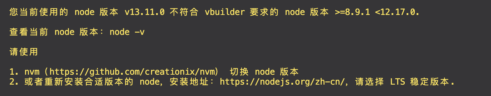
    node 版本不对 需要指定 node 的版本(这里建议使用 nvm 对 node 版本进行统一管理,具体详见<https://github.com/nvm-sh/nvm>)

    <!-- 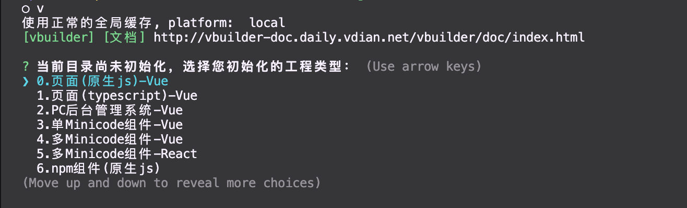
    (1)、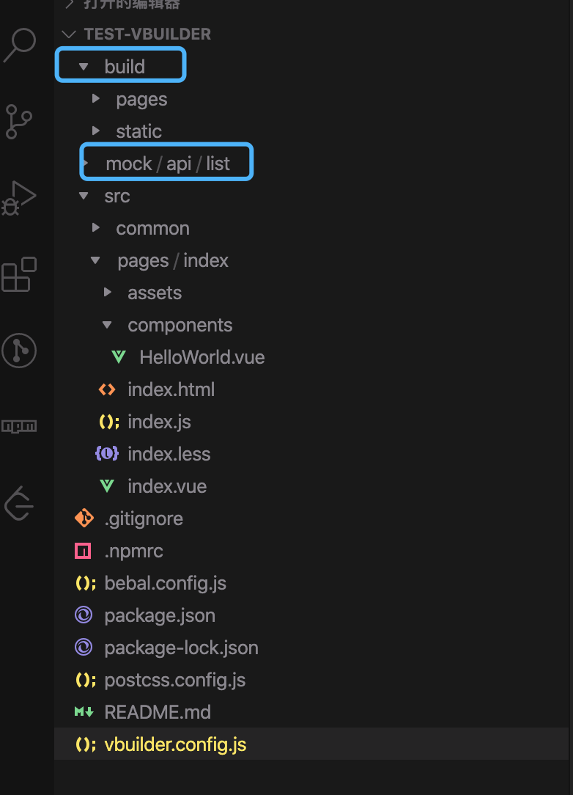这个版本基本不用可以忽略 -->
    <!-- (2)、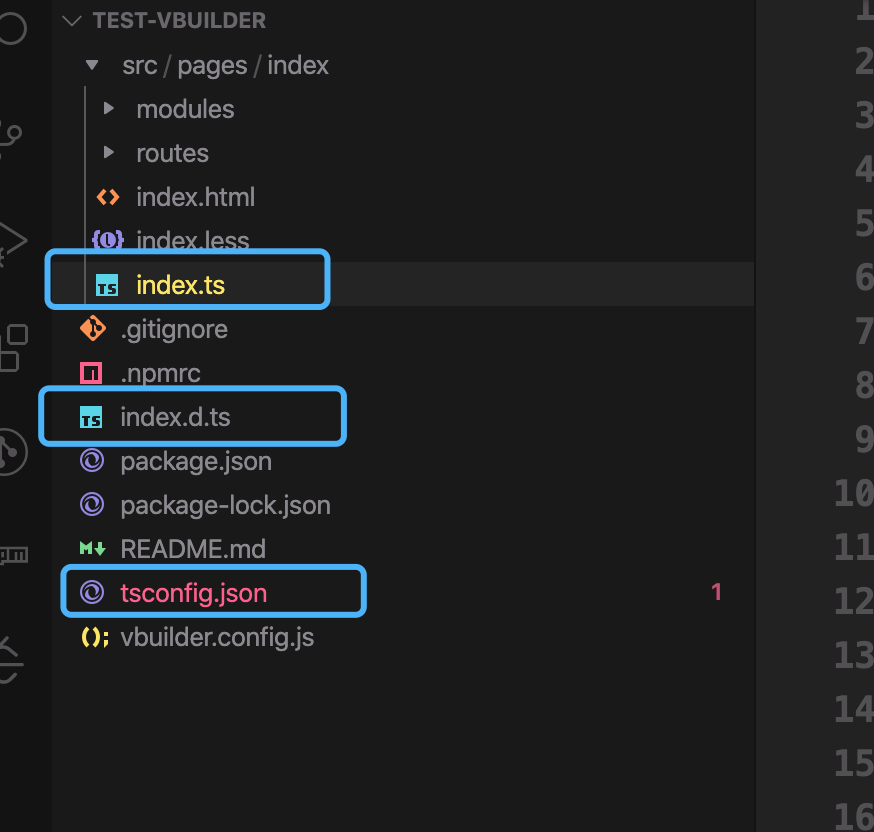 多了 tsconfig.json(ts 输出规范配置文件) 主入口文件由 index.js 变成 index.ts -->
    <!-- (3)、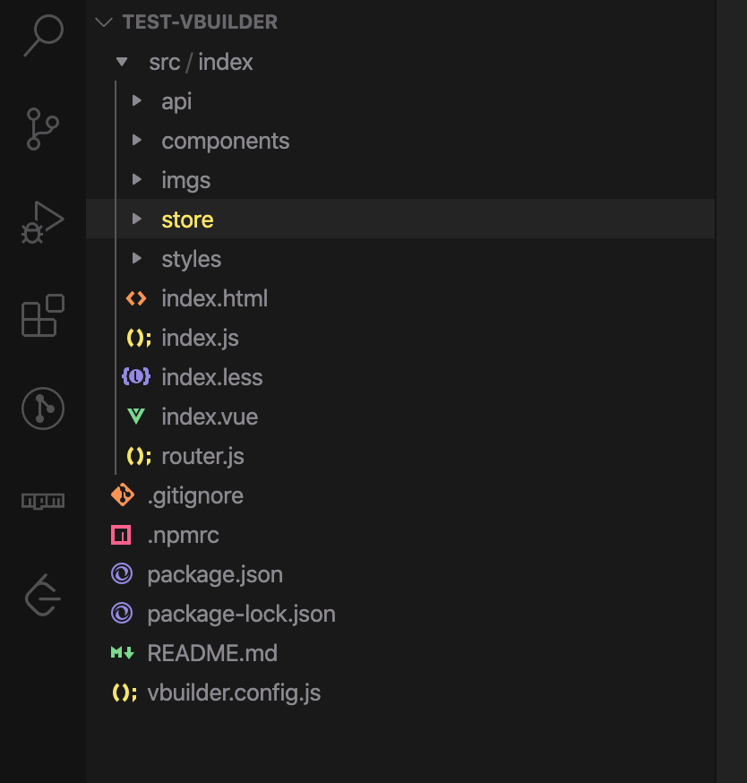 里面集成了 vuex vue-router 等依赖，开箱即用 -->
    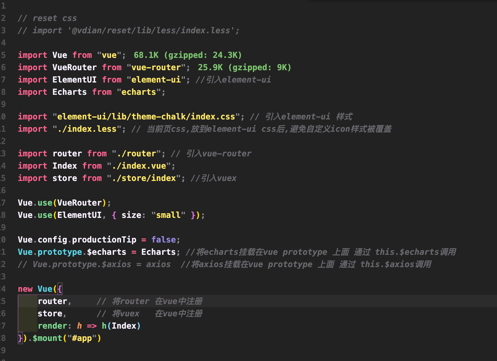 具体作用详见后面的备注
    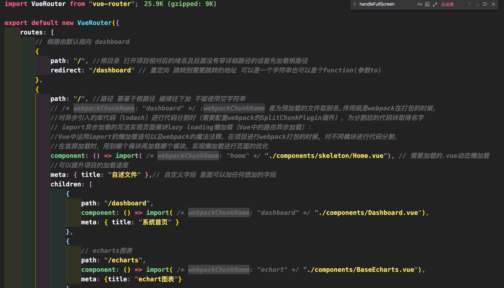
    code /Users/opera/Documents/Projects/husky-metis

4. 通常来说，内部项目 element-ui 库就能够胜任，只需在 shell 命令框执行 npm install Element-ui -S 下载依赖包 在项目的入口文件  index.js 中引入即可，即可在整个项目中使用
5. 解决完 ui 库，下一步就是解决 axios npm install axios --save 并在 index.ts 或者 index.js 引入、挂载到 vue prototype 上即可

# d.vdian.net新前端架构下的利弊

    利：
        1.快；
        2.项目独立化、各项目之间互不影响，解决了分支、测试环境的问题；
        3.（重构过的项目）更精简、更高效的项目代码,容易上手；
        4.组件公共化（头部菜单栏、左侧菜单栏），发布到微店源上面；
        5.动态获取公共组件的版本号，（husky-header）从zebra拿接口，实时获取最新版本号，一次引入，后续所有的迭代更新都能无缝的展示到项目中，用户全程不用手动操作
        6.代替了部分接口的功能，例如：数据开发每次关闭页面之前都会有弹窗提示，因为需要将数据发送到后端进行保存，现在做了数据常驻本地化,（浏览器无痕模式除外）
        7.减少zebra的发布时间；
        8.能够更好的减小依赖包版本迭代带来的影响；

    弊：
        1.因为现在所拆分出的项目基本是重新迭代过的版本,新项目地路由和老项目重写，之前各个模块之间的相互跳转，需要人肉一个个找出来，相对比较耗时，并且存在查找不干净的可能
        2.新拆分出来的项目，左侧菜单栏、路由配置、ajax数据请求都已经进行过封装，接手人需要重新学习,增加时间成本
        3.代码过分的独立可能会让后端之前写的类似的代码无法实时查看，需要跨项目查看

# 有哪些开箱即用的前端组件

1. ui库：antd、element-ui（element-ui目前与vue兼容度最高的前端ui库）目前基于vue2的element-ui在github上面更新频率很少可能是为了vue3作准备 等到vue3 8月份出正式版之后这些ui库可能会重新活跃起来

2. ajax库:axios、fetch（axios:基于 promise 的 HTTP 客户端 axios 则是其中非常流行的一种ajax库，vue官方曾指定axios作为vue的ajax库，vue-axios）
   code /Users/opera/Documents/Projects/ajax

3. 视图库：Echarts、G2、G6; echarts 是百度的视图库
优点：使用人数多，上手容易、所遇到的问题在网络上都比较好找
缺点：样式相对比较老套、没有脑型图这种复杂的图（像dag图这种要求比较高的项目）;G2、G6 阿里旗下的视图库 优点：样式比较新颖、所包含的视图库种类比较多、有脑型图这种比较复杂的图表； 缺点：文档相对于echarts的文档比较难读、出现问题在网上比较难找，（钉钉群G6群作者回复率比较低）、且主要使用框架都是react）

4. 处理时间、处理对象：jutils-src、lodash处理时间、处理对象都比较好,比较轻量级 （husky-web 目前在用moment库，打包完成之后60多kb 和vue 未打包的时候一样大)

# 前端最佳实践
1. 化繁为简的watchers
    场景还原：
    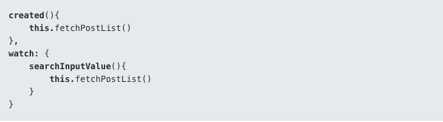
    组件创建的时候我们获取一次列表，同时监听input框，每当发生变化的时候重新获取一次筛选后的列表这个场景很常见
    解决方法：
    首先，在watchers中，可以直接使用函数的字面量名称；其次，声明immediate:true表示创建组件时立马执行一次
    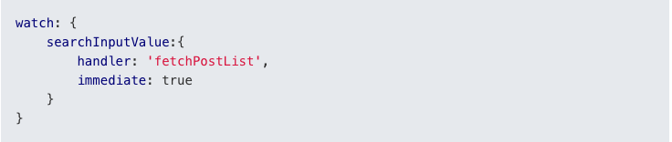
2. 组件穿参：vue中一个比较令人烦恼的事情是属性只能从父组件传递给子组件。这也就意味着当你想向嵌套层级比较深组件数据传递，只能由父组件传递给子组件，子组件再传递给孙子组件...像下面这样：
    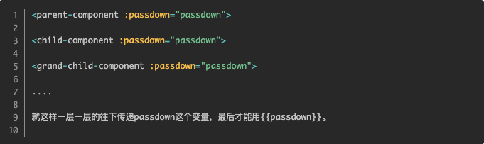
    假如我们需要传递的属性只有1,2个还行，但是如果我们要传递的有几个或者10来个的情况，这会是什么样的场景，我们会在每个组件不停的props，每个必须写很多遍。attrs由运而生
    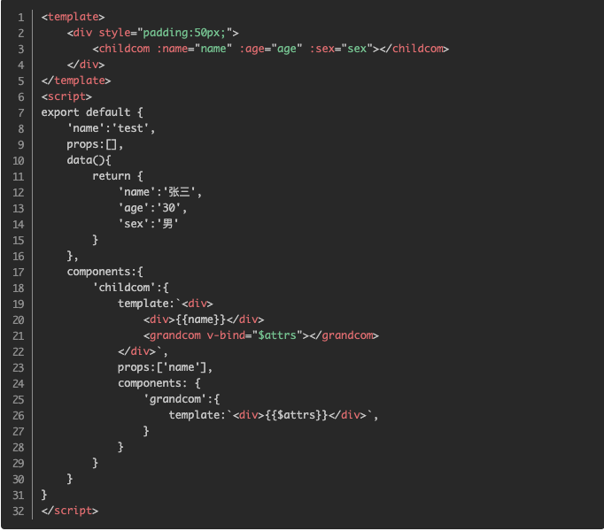
    顺道补充一下：listeners
    父组件-子组件-孙子组件，现在我要你在孙子组件里改变父组件的值，$listeners给我们提供了一个新的思路。话不多说，直接上代码
    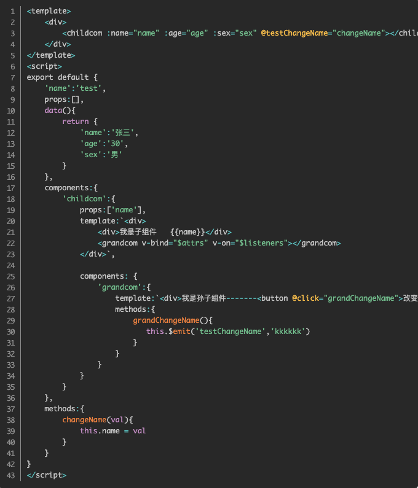
    拓展组件子组件数据双向绑定 code /Users/opera/Documents/vbuilder-ts
3. vuex的替代品 observable (称之为迷你vuex) 随着组件的细化，就会遇到多组件状态共享的情况， Vuex当然可以解决这类问题，不过就像 Vuex官方文档所说的，如果应用不够大，为避免代码繁琐冗余，最好不要使用它 直接上代码
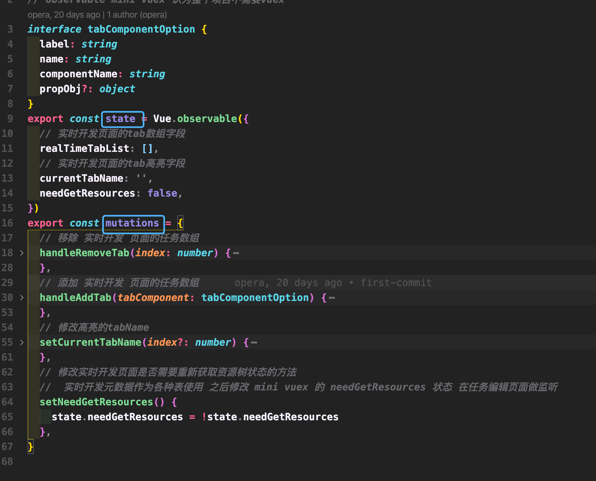
如何使用:state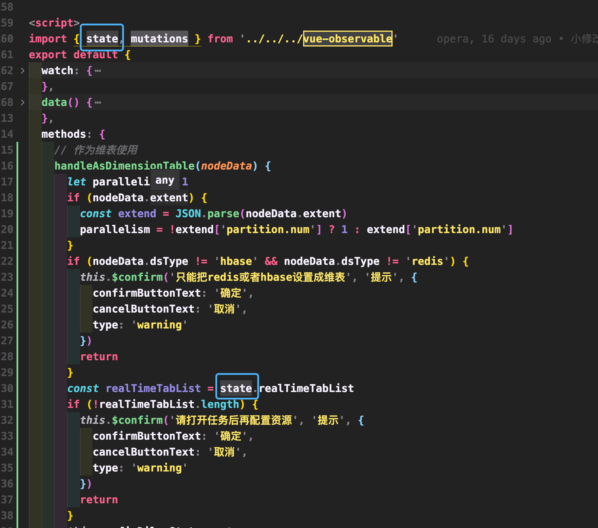
       mutations: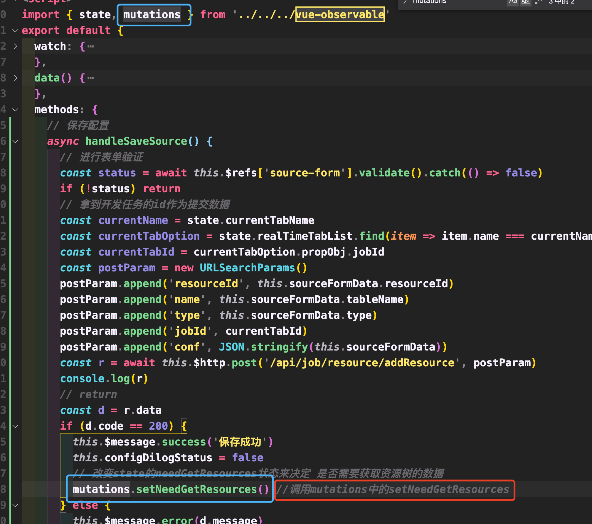
4. 始终在 v-for 中使用 :key;在需要操纵数据时，将key属性与v-for指令一起使用可以让程序保持恒定且可预测。这样Vue就可以跟踪组件状态，并对不同的元素有一个常量引用。在使用动画或Vue转换时，key 非常有用。如果没有key ，Vue只会尝试使DOM尽可能高效。 这可能意味着v-for中的元素可能会出现乱序，或者它们的行为难以预测。 如果我们对每个元素都有唯一的键引用，那么我们可以更好地预测Vue应用程序将如何精确地处理DOM操作。
    演示 /Users/opera/Documents/study/vite-demo
5. 在事件中使用短横线命名 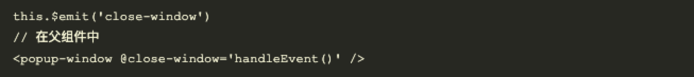
6. 使用驼峰式声明 props，并在模板中使用短横线命名来访问 props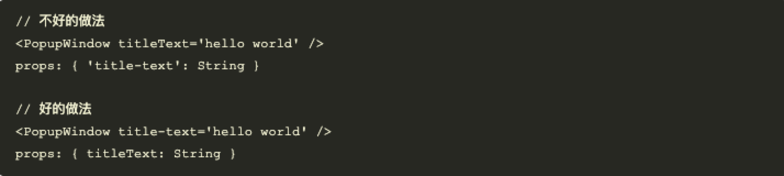
7. 不要在同个元素上同时使用v-if和v-for指令 v-for比v-if的优先级要高，写个父标签使用v-if 就好
8. 巧用template 相信 v-if 在开发中是用得最多的指令，那么你一定遇到过这样的场景，多个元素需要切换，而且切换条件都一样，一般都会使用一个元素包裹起来，在这个元素上做切换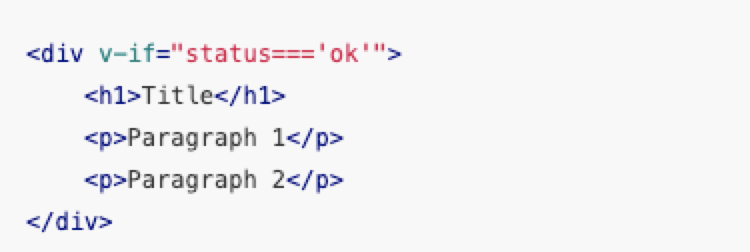如果像上面的 div 只是为了切换条件而存在，还导致元素层级嵌套多一层，那么它没有“存在的意义”。
我们都知道在声明页面模板时，所有元素需要放在  template 元素内。除此之外，它还能在模板内使用，template 元素作为不可见的包裹元素，只是在运行时做处理，最终的渲染结果并不包含它。如果像上面的 div 只是为了切换条件而存在，还导致元素层级嵌套多一层，那么它没有“存在的意义”。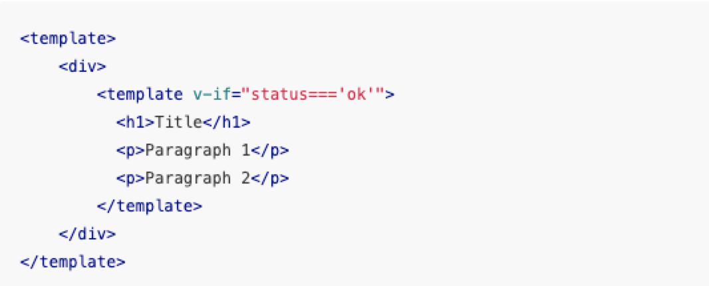 同样的，我们也可以在 template上使用 v-for 指令，这种方式还能解决 v-for 和 v-if 同时使用报出的警告问题。

9. v-if和-v-show 页面组件切换比较频繁的时候使用v-show 只加载一次的话就v-if
10.  一个组件中 create、mounted 二者出现一个就好，推荐使用munted 
11.   select-option 尽量少使用 v-for 来循环（死数据的时候)，直接写死的话vue 会将其打成静态字符串，提升编译速度 
12.  给大家一份我自己的vscode 格式化清单 以及vscode 插件清单 如果大家以后和我一起和我开发的时候,就能造成不必要的格式化冲突 以及分支冲突
